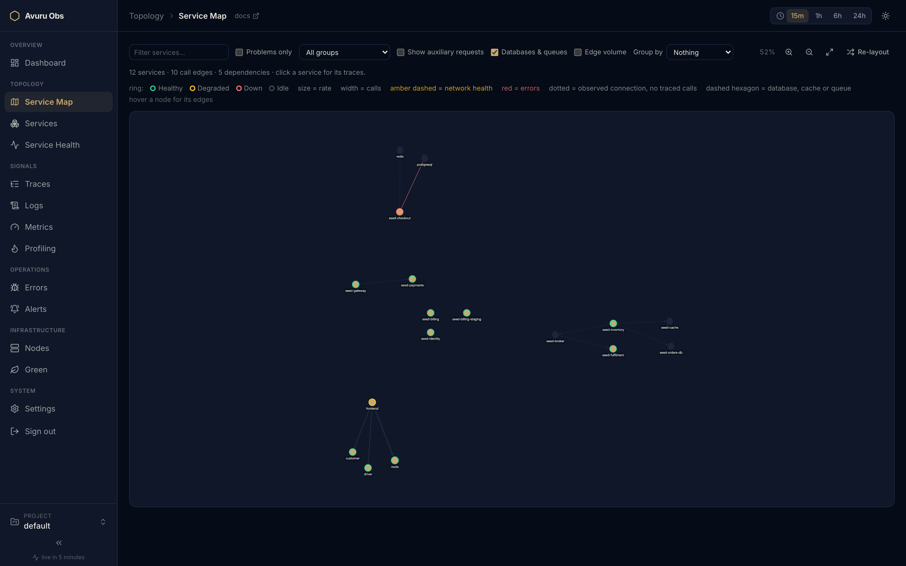
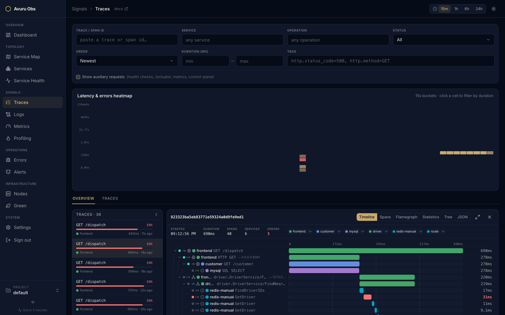
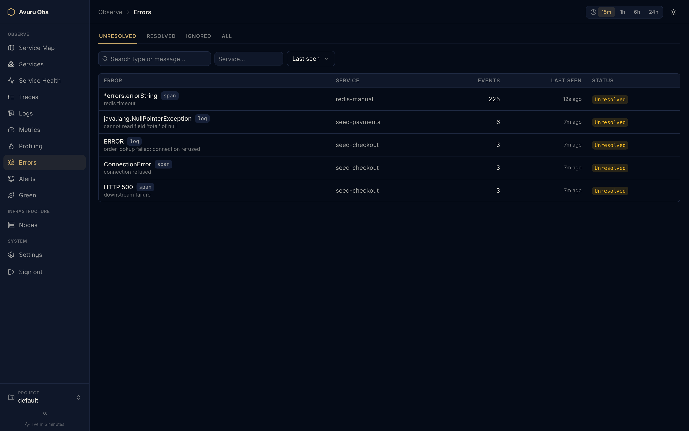
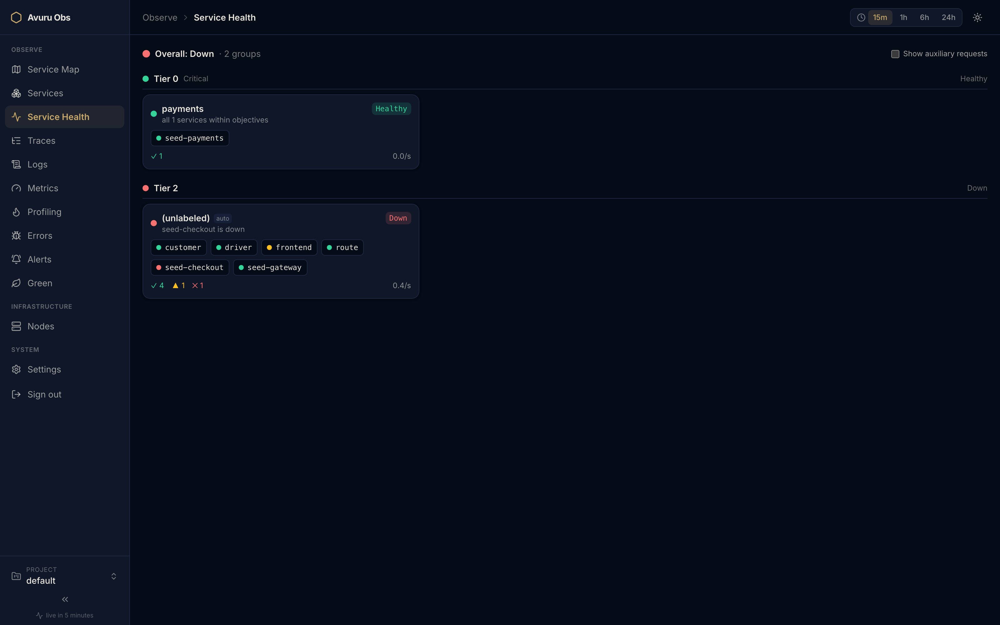
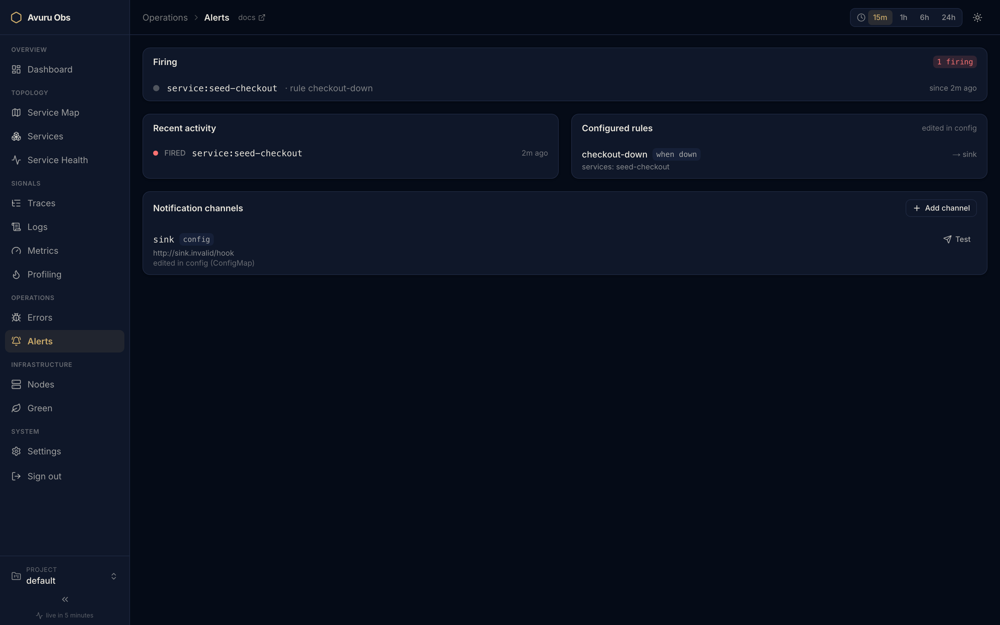
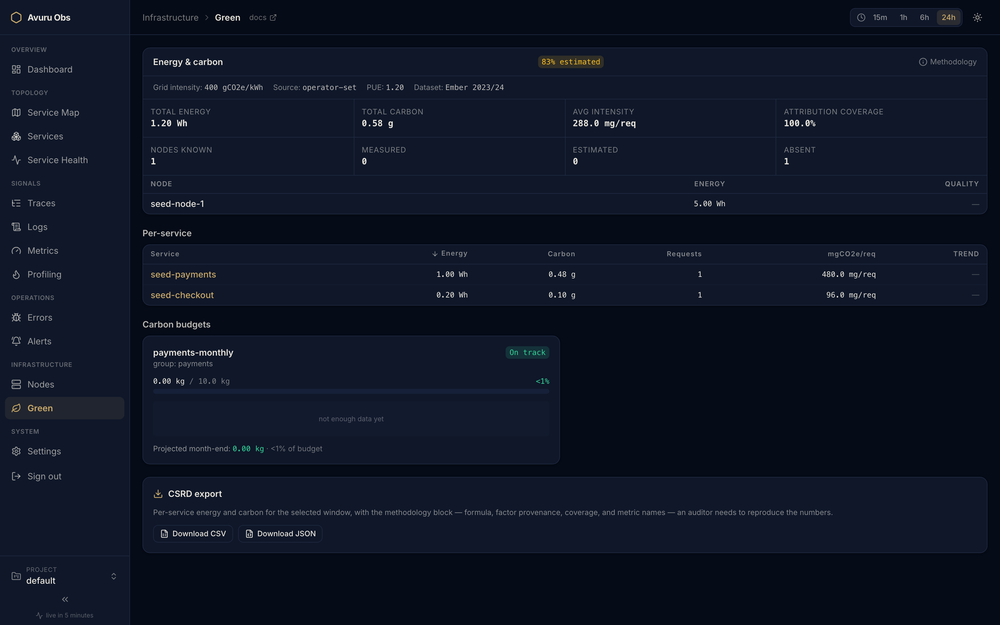

# Avuru Obs

**All-in-one observability — traces, metrics, logs, continuous profiling.
Live in 5 minutes, zero code changes.**

[](https://github.com/avuruvision/avuru-obs/actions/workflows/ci.yml)
[](LICENSE)
[](https://github.com/avuruvision/avuru-obs/releases)
[](https://avuruobs.io)

**[Documentation](https://avuruobs.io)** ·
**[How it compares](https://avuruobs.io/docs/compare)** ·
**[Quickstart](#quickstart)** · Live demo at demo.avuruobs.io — coming soon

Avuru Obs keeps every signal — traces, metrics, logs, profiles — in one storage
engine (ClickHouse), behind one binary control plane and one UI. eBPF
auto-discovers your services: install the Helm chart and watch the service map
light up — no SDK, no sidecars, no YAML archaeology.



<details>
<summary><b>More screenshots</b> — trace waterfall, error tracking, service health, alerting, Green Obs</summary>

| | |
|---|---|
|  |  |
|  |  |
|  | |

</details>

> **Status: v0.5.0 released** (2026-08-17); `main` is under active development
> toward v0.6. See [CHANGELOG.md](CHANGELOG.md) for what shipped,
> [ROADMAP.md](ROADMAP.md) for where it's headed and
> [`agent_docs/architecture.md`](agent_docs/architecture.md) for the living
> architecture.

## How it works

```
sensor DaemonSet (eBPF: traces · RED · logs · profiles)
        │ OTLP
        ▼
gateway (minimal OTel Collector) ──► ClickHouse (all signals)
                                          ▲ SQL
hub (Go binary: API + OpAMP config plane)   ◄── UI (static SPA, own pod)
```

- **Zero-code**: OpenTelemetry eBPF Instrumentation (OBI) for traces + RED
  metrics, with the live service map derived from those traces; OTLP ingest
  for apps you've already instrumented.
- **One store**: ClickHouse for traces, metrics, logs, profiles, and flows.
- **Drop-in, and not only for OTLP**: point the exporters you already run at
  the gateway — OTLP, Jaeger, Zipkin, Prometheus remote-write or Loki push,
  one values flag per protocol, all default off. No SDK or code changes (a
  hard product requirement), and per-project ingest keys are enforced the
  same way whatever protocol the data arrived on. Dual-write to your existing
  backend while you evaluate, so adopting avuru-obs is a reversible decision.

Beyond the core signals, the day-2 layer:

- **Error tracking** — deduplicated, triageable issues derived in-database
  from spans and logs; browser SDKs report by changing a Sentry DSN (opt-in
  ingest endpoint).
- **Service health & alerting** — criticality tiers (T0/T1/T2) with
  critical-dependency propagation, and webhook notifications on health
  transitions.
- **Green Obs — energy & carbon** *(opt-in)* — per-service and per-node Wh and
  gCO2e from Kepler/RAPL, carbon budgets, and a CSRD-ready export that states
  its methodology. Before trusting the numbers in production, walk
  [the RAPL validation runbook](docs/runbooks/green-rapl-validation.md).
- **Auth & SSO** — secure-by-default login, per-project roles, OIDC single
  sign-on, and opt-in anonymous read access for public demos.
- **Modules** — one switch per signal family gates schema, pipeline, API and
  UI together; run only what you need.
- **Secure by default**: login + per-project RBAC out of the box, and
  enterprise SSO via any OIDC IdP (Keycloak, Entra, Okta, ...) in OSS — IdP
  groups map to per-project roles, `forceSSO` for IdP-only fleets — with no
  extra components (no oauth2-proxy, no Dex).
- **Projects you administer, and telemetry that proves whose it is** *(v0.3)* —
  create, rename and delete projects from the UI, then mint **per-project
  ingest keys**: in `enforce` mode the key decides where data lands, so a
  sender that lies about its tenant lands where its key says. Default `log`
  mode changes nothing about the pipeline, so the drop-in promise survives the
  upgrade.
- **A project keeps only what it is worth keeping** *(v0.6)* — set a shorter
  retention window on any UI-managed project: a noisy staging tenant need not
  hold thirty days of traces because production does. The hub trims that
  tenant's telemetry hourly, scoped by project, while the install-wide TTL stays
  the backstop — so the saving is real storage, not a dashboard filter.
- **Green that works on cloud VMs** *(v0.3)* — public-cloud instances expose no
  RAPL, so an opt-in power model fills the gap; every estimated number is
  labeled as such end to end and never blended with measured joules.
- **A demo you can hand to anyone** *(v0.3)* — one click signs a visitor in as
  a read-only viewer scoped to a single project; the shared password never
  reaches the browser.
- **Accounts you can administer** *(v0.4)* — the full user lifecycle from the
  UI (edit, reset, disable-first delete) plus self-service password rotation,
  with the review that built it closing three account-takeover paths.
- **Operate it from the UI** *(v0.5)* — per-signal collection switches the
  sensor follows in seconds (opt-in, behind a deliberately narrow Role),
  service groups, storage and access visibility, and the SSO group→role
  mapping all authored in Settings instead of `values.yaml`; a Dashboard
  landing screen answers "how is the estate doing" at a glance.
- **Personal API tokens** *(v0.5)* — scripts and CI call the API with
  `Authorization: Bearer avurut_…` instead of a scraped cookie: hashed at
  rest, shown once, resolving to the owner's live permissions, so disabling a
  user silences every token they hold.

## Quickstart

**Kubernetes (the real install).** The chart is published to GHCR as an OCI
artifact — no repo to add:

```bash
helm install avuruobs oci://ghcr.io/avuruvision/charts/avuruobs \
  --version <X.Y.Z> -n avuruobs --create-namespace
```

Or let the installer resolve the latest release and wait for rollout (it only
runs `helm`/`kubectl` against your current context — read it first if you like,
`--dry-run` prints the exact command):

```bash
curl -fsSL https://raw.githubusercontent.com/avuruvision/avuru-obs/main/deploy/install.sh | sh
```

The chart and every image we build are cosign-signed and multi-arch; see
[RELEASING.md](RELEASING.md#verifying-a-release) to verify a release.

**Laptop (no cluster, no checkout).** One compose file pulls the released
images and a demo app so the service map lights up immediately:

```bash
curl -fsSLO https://raw.githubusercontent.com/avuruvision/avuru-obs/main/deploy/compose/docker-compose.release.yaml
docker compose -f docker-compose.release.yaml up --wait   # then open http://localhost:3001
```

Full setup, sizing, and configuration: [`deploy/helm/README.md`](deploy/helm/README.md).

## Repository layout

| Path | What | Stack |
|---|---|---|
| [`hub/`](hub/README.md) | Control plane: REST/WS API, OpAMP, alerting, storage interface | Go |
| [`ui/`](ui/README.md) | Static-export SPA (own nginx pod) | Next.js / TS |
| [`gateway/`](gateway/) | Minimal OTel Collector distro (OCB manifest) | OCB / YAML |
| [`sensor/`](sensor/README.md) | DaemonSet assembly (OBI + collector + profiler) | YAML |
| [`deploy/`](deploy/helm/README.md) | Helm chart (flagship) + [docker-compose sandbox](deploy/compose/README.md) | Helm / compose |
| [`e2e/`](e2e/) | End-to-end tests (Go + Playwright) | Go / TS |
| [`tools/`](tools/) | Dev tooling (e.g. OTLP fixture seeder) | Go |
| [`agent_docs/`](agent_docs/README.md) | Topic docs for contributors (and AI agents) | — |
| [`design/`](design/README.md) | Avuru Enhancement Proposals (AEPs) | — |

## Getting started (contributors)

Read [AGENTS.md](AGENTS.md) first (yes, even humans — it's the canonical
developer guide) and [`agent_docs/development.md`](agent_docs/development.md).

**Prerequisites:** Go 1.26, Node ≥22, Docker (Colima on macOS),
Helm 3, and GNU make.

```bash
make ui hub   # build the UI static export and the hub binary
make check    # everything CI runs (build + test + lint across components)
```

Per-component build/test/run lives in each component's README
([hub](hub/README.md), [ui](ui/README.md)) and in
[`agent_docs/`](agent_docs/README.md). To evaluate without building anything,
use the [Quickstart](#quickstart) above — both paths run released artifacts.

## How it compares

One store instead of four backends: every signal lands in the same ClickHouse,
so cross-signal correlation is a query, not a federation problem. The service
map comes from eBPF — no SDKs, no sidecars — and the day-2 layer (errors,
health, alerting, energy) ships in the same AGPL codebase, not a paid tier.
Detailed, honest comparisons live on the docs site:
[vs SigNoz](https://avuruobs.io/docs/compare/signoz) ·
[vs Coroot](https://avuruobs.io/docs/compare/coroot) ·
[vs the Grafana stack](https://avuruobs.io/docs/compare/grafana-stack) ·
[vs Datadog](https://avuruobs.io/docs/compare/datadog) ·
[vs Sentry](https://avuruobs.io/docs/compare/sentry) ·
[full matrix](https://avuruobs.io/docs/compare)

## Contributing & community

| Doc | Purpose |
|---|---|
| [CONTRIBUTING.md](CONTRIBUTING.md) | How to propose and submit changes |
| [GOVERNANCE.md](GOVERNANCE.md) | How decisions are made; becoming a maintainer |
| [MAINTAINERS.md](MAINTAINERS.md) | Who maintains what |
| [CODE_OF_CONDUCT.md](CODE_OF_CONDUCT.md) | Community standards |
| [CLA.md](CLA.md) | Contributor License Agreement — signed automatically on your first PR |
| [LICENSING.md](LICENSING.md) | What the AGPL means for you; editions and sustainability |
| [SECURITY.md](SECURITY.md) | Reporting vulnerabilities (privately) |
| [AI_POLICY.md](AI_POLICY.md) | Using AI tools when contributing |
| [COMMIT-SIGNING-SETUP.md](COMMIT-SIGNING-SETUP.md) | Required signed-commit setup |
| [design/](design/README.md) | Enhancement-proposal (AEP) process |
| [RELEASING.md](RELEASING.md) · [ROADMAP.md](ROADMAP.md) · [CHANGELOG.md](CHANGELOG.md) | Release process, direction, history |

New here? Look for **good first issue** labels, and open an issue or
[discussion](CONTRIBUTING.md) before non-trivial work.

## Support the project

Avuru Obs is independent open-source software: AGPL-licensed, self-hosted,
no telemetry phoning home. If it replaces a per-host observability bill for
your team, consider funding the work that keeps it moving — CI, eBPF test
hardware across kernels, and signed multi-arch releases. Individual
sponsorship (GitHub Sponsors, Ko-Fi, Buy Me a Coffee) is being set up —
check back here for links once live.

Organizations that need an invoiceable arrangement: contact
**egilberny@lab.luxavuru.com** for commercial / dual licensing. Sponsors at
a sustained tier get their logo featured here.

## License

[AGPL-3.0](LICENSE) — the same license as Grafana. Self-hosting unmodified
puts zero obligations on you, and the [CLA (§2.2)](CLA.md) pledges that
everything shipped here stays open under AGPL-3.0 forever. The node agent is
upstream OBI (Apache-2.0). A commercial enterprise edition is planned as a
separate offering — it adds to the community edition, never removes from it.
Details, FAQ, and dual-licensing contact: [LICENSING.md](LICENSING.md).
